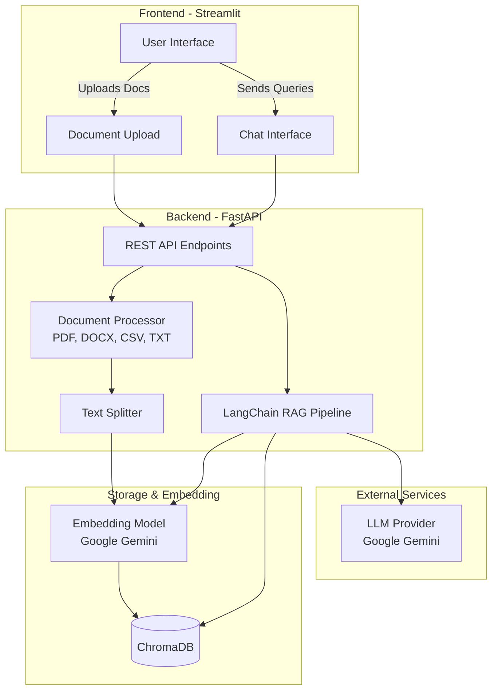

# 🤖 Resona - Multi-Document RAG Chatbot

🚀 **Live Demo:** [https://resona-nklu.onrender.com](https://resona-nklu.onrender.com/)

A production-quality, multi-document Retrieval-Augmented Generation (RAG) system built with FastAPI, Streamlit, LangChain, and ChromaDB.

## 🌟 Features
- **Multi-Format Support:** Ingest PDF, DOCX, CSV, and TXT files.
- **Smart Chunking:** Employs `RecursiveCharacterTextSplitter` to preserve semantic context.
- **Google Embeddings:** Uses Google Gemini Embeddings for lightweight and fast vector generation.
- **Conversational Memory:** History-aware retriever maintains context across chat interactions.
- **Scalable Architecture:** Decoupled FastAPI backend and Streamlit frontend.
- **Docker Ready:** Fully containerized for easy deployment.

---

## 🏗️ Architecture



---

## 🚀 Getting Started

### Prerequisites
- Python 3.11+
- Docker & Docker Compose (Optional, for containerized running)
- A Google Gemini API Key

### 1. Clone & Configure
First, configure your API keys by creating a `.env` file in the root directory:
```bash
GOOGLE_API_KEY=your_gemini_api_key_here
```

### 2. Run with Docker (Recommended)
You can spin up both the backend and frontend simultaneously using Docker Compose:
```bash
docker-compose up --build
```
- The **Streamlit UI** will be available at: `http://localhost:8501`
- The **FastAPI Docs** will be available at: `http://localhost:8000/docs`

### 3. Run Locally (Without Docker)

#### Setup Virtual Environment
```bash
python -m venv venv
source venv/bin/activate  # On Windows: venv\Scripts\activate
```

#### Start the Backend
```bash
cd backend
pip install -r requirements.txt
uvicorn main:app --reload --port 8000
```

#### Start the Frontend
In a new terminal:
```bash
cd frontend
pip install -r requirements.txt
streamlit run app.py
```

---

## 🧪 Testing
The project includes automated tests for core components. To run them:
```bash
pip install pytest httpx
pytest tests/
```
